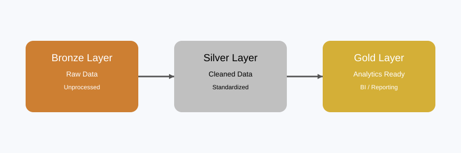

# 🏢 Global Tech Layoffs Data Cleaning Project

🌐 Language / Langue  
- English  
- Français  

---

<details>
<summary>🇬🇧 English Version</summary>

# 🏢 Layoffs ETL Pipeline (SQL Server)

## 📌 Project Overview
This project builds an end-to-end ETL pipeline using SQL Server to clean and transform a global layoffs dataset.

The dataset contains company layoff records across multiple industries and countries, including information such as total layoffs, layoff percentages, funding raised, and company growth stage.

The pipeline follows a **Medallion Architecture (Bronze → Silver → Gold)** to progressively clean, standardize, and prepare data for analytics and reporting.

---

# 🏗️ Data Architecture



### 🥉 Bronze Layer (Raw Data)
- Raw source data ingested without modification
- Preserves original records for traceability and auditing
- Serves as the single source of truth

---

### 🥈 Silver Layer (Cleaned Data)
- Removes duplicate records
- Standardizes inconsistent categorical values
- Converts date fields into proper SQL `DATE` format
- Handles missing values using business rules
- Preserves analytical NULL values where appropriate

---

### 🥇 Gold Layer (Analytics-Ready Data)
- Final cleaned and trusted dataset
- Optimized for exploratory analysis and reporting
- Ready for dashboards and business intelligence tools

---

# 🛠️ Tech Stack
- SQL Server
- T-SQL
- ETL Pipeline Design
- Data Cleaning
- Medallion Architecture

---

# 🧹 Key Transformations

## 1. Duplicate Removal
Removed duplicate records using `ROW_NUMBER()` based on:

- Company
- Location
- Industry
- Total Laid Off
- Date
- Percentage Laid Off
- Stage
- Country
- Funds Raised

---

## 2. Data Standardization
Standardized inconsistent values such as:

- `Crypto Currency`, `Crypto/Web3` → `Crypto`
- `United States.` → `United States`

---

## 3. Date Formatting
Converted the `date` column into SQL Server `DATE` datatype to support:

- Filtering
- Aggregation
- Time-series analysis

---

## 4. Missing Value Handling

Missing `industry` values were populated using existing records from the same company.

The process uses a self-join on the `company` column to locate rows where:

- One record has a NULL `industry`
- Another record for the same company contains a valid `industry`

The valid industry value is then used to update the missing entry.

### Example

| Company | Industry |
|---|---|
| Airbnb | NULL |
| Airbnb | Travel |

Result:

| Company | Industry |
|---|---|
| Airbnb | Travel |

---

## 5. NULL Preservation
Retained NULL values in:

- `total_laid_off`
- `percentage_laid_off`
- `funds_raised_millions`

to preserve source accuracy and avoid misleading assumptions.

---

# 📊 Final Output
The Gold layer provides a clean and structured layoffs dataset ready for:

- Layoff trend analysis
- Industry impact analysis
- Country-level reporting
- Executive dashboards
- BI tools (Power BI / Tableau)

---

# 🚀 Outcome
This project demonstrates practical SQL skills in:

- Data cleaning and transformation
- ETL pipeline development
- Layered data architecture design
- Real-world data quality management
- Building analytics-ready datasets

---

# 📂 Project Structure

```bash
SQL_Data_Cleaning_Global_Tech_Layoffs/
│
├── data/
│   ├── Global_Tech_Layoffs_Data_for_Data_Cleaning.csv
│   └── Global_Tech_Layoffs_Clean_Data.csv
│
├── scripts/
│   └── SQL_Data_Cleaning_Global_Tech_Layoffs.sql
│
└── README.md
```

</details>

---

<details>
<summary>🇫🇷 Version Française</summary>

# 🏢 Pipeline ETL des Licenciements (SQL Server)

## 📌 Aperçu du projet
Ce projet met en place un pipeline ETL complet utilisant SQL Server pour nettoyer et transformer un dataset mondial sur les licenciements dans le secteur technologique.

Le dataset contient des informations sur les licenciements d’entreprises dans plusieurs industries et pays, incluant le nombre total de licenciements, le pourcentage de licenciements, les fonds levés et le stade de croissance des entreprises.

Le pipeline suit une **architecture en médaillon (Bronze → Silver → Gold)** afin de nettoyer, standardiser et structurer progressivement les données pour l’analyse et le reporting.

---

# 🏗️ Architecture des données


### 🥉 Couche Bronze (Données brutes)
- Données importées directement depuis la source sans transformation
- Conserve les données originales pour traçabilité et audit
- Sert de source de vérité unique"

---

### 🥈 Couche Silver (Données nettoyées)
- Suppression des doublons
- Standardisation des valeurs catégorielles incohérentes
- Conversion des dates au format SQL `DATE`
- Traitement des valeurs manquantes selon des règles métier
- Conservation des valeurs NULL importantes pour l’analyse

---

### 🥇 Couche Gold (Données prêtes pour l’analyse)
- Dataset final nettoyé et fiable
- Optimisé pour l’analyse exploratoire et le reporting
- Prêt pour les tableaux de bord et outils BI

---

# 🛠️ Technologies utilisées
- SQL Server
- T-SQL
- Conception de pipeline ETL
- Nettoyage des données
- Architecture en médaillon

---

# 🧹 Transformations principales

## 1. Suppression des doublons
Suppression des doublons à l’aide de `ROW_NUMBER()` basé sur :

- Entreprise
- Localisation
- Industrie
- Total des licenciements
- Date
- Pourcentage de licenciements
- Stade
- Pays
- Fonds levés

---

## 2. Standardisation des données
Uniformisation des valeurs incohérentes telles que :

- `Crypto Currency`, `Crypto/Web3` → `Crypto`
- `United States.` → `United States`

---

## 3. Formatage des dates
Conversion de la colonne `date` au format SQL Server `DATE` pour permettre :

- Le filtrage
- Les agrégations
- L’analyse temporelle

---

## 4. Gestion des valeurs manquantes

Les valeurs manquantes de la colonne `industry` sont complétées à partir des autres enregistrements de la même entreprise.

Le processus utilise une jointure sur la colonne `company` pour identifier les cas où :

- Un enregistrement a `industry = NULL`
- Un autre enregistrement de la même entreprise contient une valeur valide

La valeur valide est ensuite utilisée pour compléter les données manquantes.

### Exemple

| Entreprise | Industrie |
|---|---|
| Airbnb | NULL |
| Airbnb | Voyage |

Résultat :

| Entreprise | Industrie |
|---|---|
| Airbnb | Voyage |

---

## 5. Conservation des valeurs NULL
Les valeurs NULL sont conservées dans :

- `total_laid_off`
- `percentage_laid_off`
- `funds_raised_millions`

afin de préserver la fidélité des données et éviter des suppositions incorrectes.

---

# 📊 Résultat final
La couche Gold fournit un dataset propre et structuré prêt pour :

- Analyse des tendances de licenciement
- Analyse par industrie
- Reporting par pays
- Tableaux de bord exécutifs
- Outils BI (Power BI / Tableau)

---

# 🚀 Résultat du projet
Ce projet démontre des compétences pratiques en SQL dans :

- Nettoyage et transformation des données
- Développement de pipeline ETL
- Conception d’architecture en couches
- Gestion de données réelles et imparfaites
- Création de datasets prêts pour l’analyse

---

# 📂 Structure du projet

```bash
SQL_Data_Cleaning_Global_Tech_Layoffs/
│
├── data/
│   ├── Global_Tech_Layoffs_Data_for_Data_Cleaning.csv
│   └── Global_Tech_Layoffs_Clean_Data.csv
│
├── scripts/
│   └── SQL_Data_Cleaning_Global_Tech_Layoffs.sql
│
└── README.md
```
</details>

---

## 📌 Author
**BRAHIM BADREDDINE**
